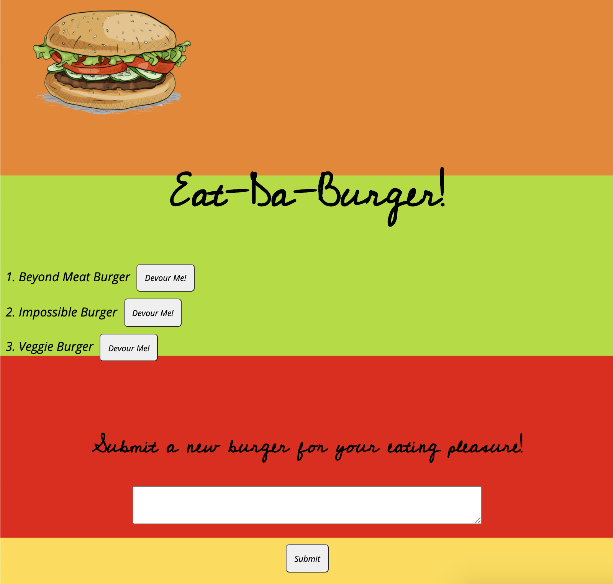
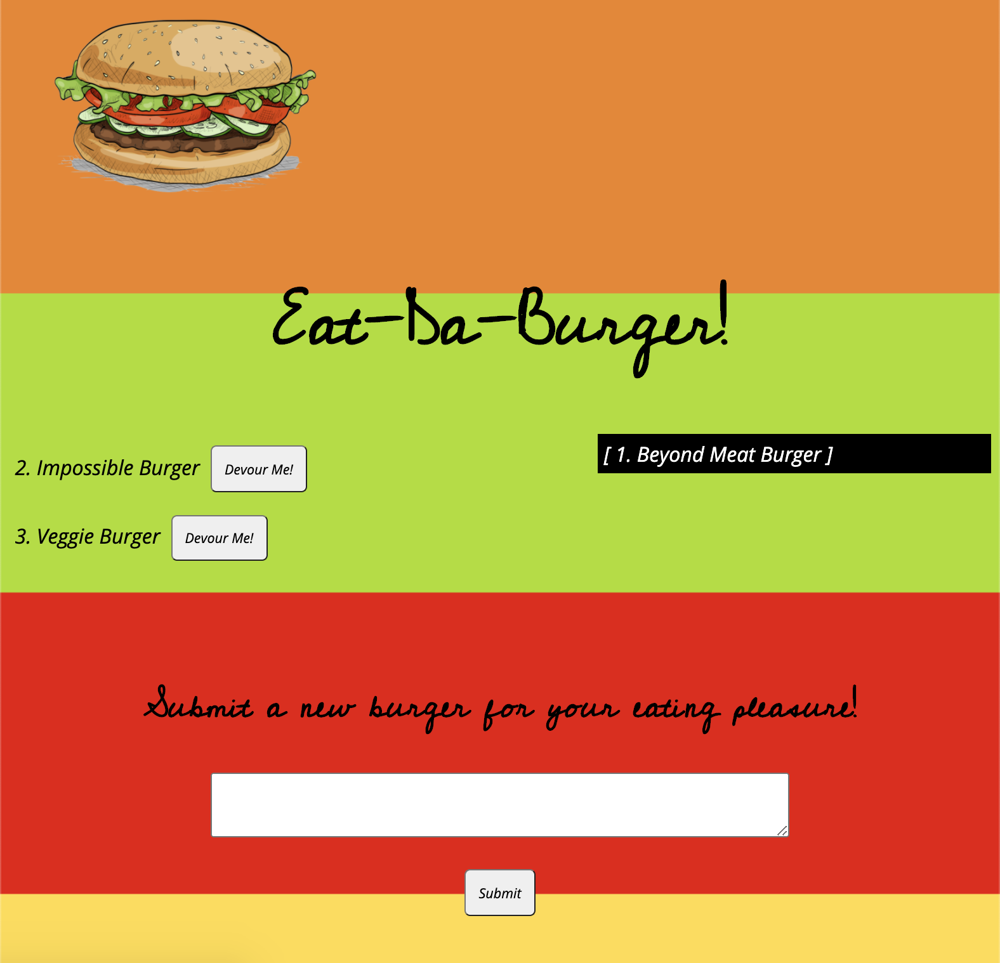

# Eat-Da-Burger! Application
[](https://www.gnu.org/licenses/gpl-3.0)

## Table of Contents
* [Description](#description)
* [Installation](#installation)
* [Technologies Used](#technologies-used)
* [Application Demo](#application-demo)
* [Contact Information](#contact-information)

## Description
This application will build a list of burgers based on user input. When users enter a burger name within the textbox and click the "Submit" button, their created burger title will be added to the lefthand side of the screen with a "Devour" button next to it--just in case they get a bit peckish! When this "Devour" button is clicked, the burger will be moved to the righthand side of the UI showing it has been thoroughly ingested by the ravenous users.

The users need not fear, however! They will be able to add as many burgers any they desire to satiate their hunger.

This application uses MySQL to store data, as well as Handlebars to dynamically create the UI for each next to-be-devoured and devoured burger on the docket.

## Installation
This application is deployed on [Heroku](https://desolate-wave-66580.herokuapp.com/) for any curious users to satiate their hunger.

Alternatively, users may clone this repository and use the following commands to make begin the application, entering them in an integrated terminal within the main directory:

* ```npm install express```
* ```npm install express-handlebars```
* ```npm install mysql```

After installing these packages to make sure the application functions, users should enter:

* ```node server.js```

This final command will make the app listen on the LocalHost PORT.

If following these commands, users should open their own browsers and go the following address to see the deployed application:

> localhost:8080

## Technologies Used
Node JS, MySQL, Express.js, Handlebars, JavaScript, CSS

## Application Demo
After following the information in the [Installation](#installation) section above--database start within MySQL, navigating to the localhost, as well as running ```node server.js```---users will be greated with an opening page that looks like this:




From here, users may add more burgers in the text box at the bottom of the page OR, if they're feeling the need to satiate their hunger, they may wish use to the **Devour Me!** button to eat a burger of their choosing, which will move the burger to the right-hand side of the screen, showing that it has been consumed:



In addition to being deployed on Heroku, a full video showing the app's functionlity can be found here:

[GIF]

## Contact Information
* Jarrod Bataille
  * Portfolio Webpage: https://jtbataille.github.io/
  * GitHub Profile: https://github.com/jtbataille
  * E-mail Address: jtbataille@gmail.com

- - -
Copyright © 2007 Free Software Foundation, Inc. <https://fsf.org/>